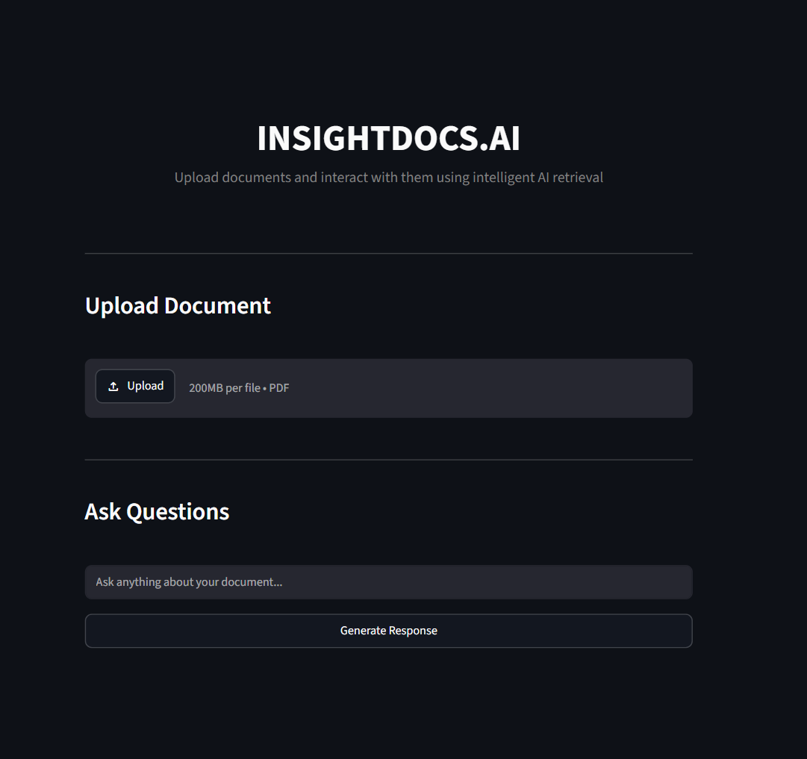
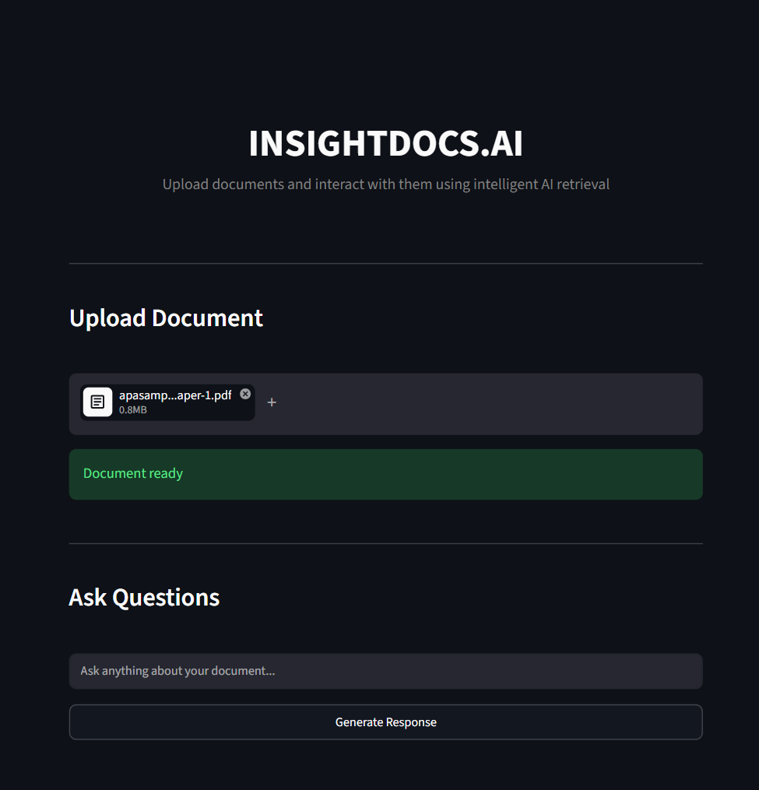
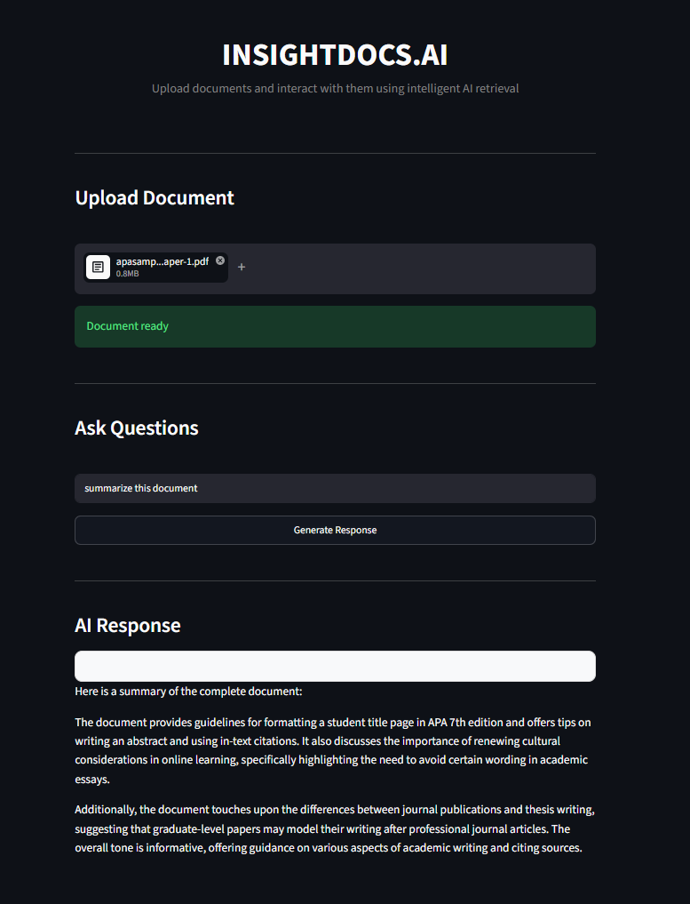

# INSIGHTDOCS.AI

An end-to-end intelligent document analysis system built to process unstructured PDF documents, perform semantic retrieval, and generate context-aware responses using Retrieval Augmented Generation (RAG) and local Large Language Models.

---

## Overview

INSIGHTDOCS.AI enables users to upload PDF documents and interact with them through natural language queries.

The system extracts document content, converts textual data into vector embeddings, retrieves semantically relevant context using vector similarity search, and generates accurate responses using a locally hosted Large Language Model.

Designed as a production-style document intelligence pipeline, the project demonstrates practical implementation of modern LLM infrastructure and retrieval systems.

---

## System Pipeline

* PDF Document Upload
* Document Parsing and Text Extraction
* Intelligent Text Chunking
* Embedding Generation
* Vector Database Storage
* Semantic Context Retrieval
* Retrieval Augmented Generation (RAG)
* Local LLM Inference
* Context-Aware Response Generation

---

## Tech Stack

* Python
* FastAPI
* Streamlit
* LangChain
* ChromaDB
* HuggingFace Embeddings
* Ollama (Local LLM Inference)
* Docker

---

## Core Features

* Intelligent PDF Document Processing
* Semantic Search over Unstructured Documents
* AI-Powered Context-Aware Question Answering
* Document Understanding and Summarization
* Retrieval Augmented Generation Pipeline
* Local LLM Deployment using Ollama
* Dockerized Backend Architecture

---

## Application Preview

### User Interface



### Document Upload & Processing



### AI Question Answering



---

## Run Application

### Backend

```bash
python -m uvicorn api:app --reload
```

### Frontend

```bash
streamlit run app.py
```

### Docker Deployment

```bash
docker build -t insightdocs .
docker run -p 8000:8000 insightdocs
```

---

## Project Focus

This project demonstrates practical implementation of:

* Retrieval Augmented Generation (RAG)
* Semantic Search Systems
* Vector Database Architecture
* Large Language Model Integration
* Production-Oriented AI Backend Development
* End-to-End Document Intelligence Systems
